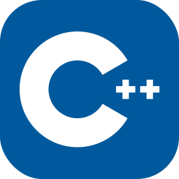

# Professional lazy bastard.
I code for fun...

## Major Projects:
- [CrossArkChat.js](https://github.com/slothyacedia/CrossArkChat) - Cross Ark Chat For Ark: Survival Evolved And Ark: Survival Ascended With Extensible API, written in JavaScript

- [Sinful Plugins](https://github.com/sinful-plugins/aseapi-plugins) - Ark: Survival Evolved Server Plugins

- [bmods-acedia](https://github.com/slothyace/bmods-acedia) - Modded Actions & Events For [BMD](https://store.steampowered.com/app/2592170/Bot_Maker_For_Discord/)

- [bmd-samples](https://github.com/slothyace/bmd-samples) - Sample Commands For [BMD](https://store.steampowered.com/app/2592170/Bot_Maker_For_Discord/)

## Languages:

  
  
  
  

## Platforms:

  
  
  
  
   
  
  

## Support Me:

